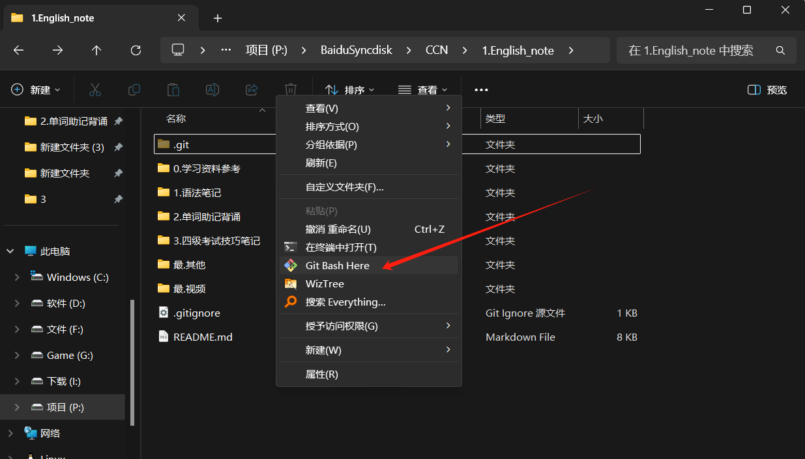

# English_note

本项目的介绍文件

## 一、推送文件步骤

以下是将文件正确推送到Git远程仓库的详细步骤和注意事项：




### **1. 初始化本地仓库（首次操作）**
在项目根目录下执行：
```bash
git init
```
这会创建一个隐藏的 `.git` 文件夹，用于管理版本控制。


### **2. 添加文件到暂存区**
#### 添加单个文件：
```bash
git add filename.txt
```

#### 添加所有文件（推荐）：
```bash
git add .
```

#### 检查状态：
```bash
git status  # 查看哪些文件被添加/修改
```


### **3. 提交到本地仓库**
```bash
git commit -m "提交描述，例如：添加新功能或修复bug"
```
- **提交信息**应清晰描述本次修改的目的。


### **4. 关联远程仓库**
#### 首次关联：
```bash
git remote add origin git@github.com:用户名/仓库名.git  # SSH方式
# 或
git remote add origin https://github.com/用户名/仓库名.git  # HTTPS方式
```

#### 检查关联：
```bash
git remote -v
```


### **5. 推送代码到远程仓库**
#### 首次推送（设置上游分支）：
```bash
git push -u origin main  # 推送至main分支（GitHub默认）
# 或
git push -u origin master  # 推送至master分支（传统默认）
```
- **`-u` 参数**：建立本地分支与远程分支的关联，后续可直接用 `git push`。

#### 非首次推送：
```bash
git push  # 简化命令，需已设置上游分支
```


### **常见问题及解决方案**
#### **1. 远程仓库已存在未合并的更改**
```bash
git pull origin main  # 先拉取远程更新，合并后再推送
```

#### **2. 忘记关联远程仓库**
```bash
git remote add origin <远程仓库URL>
```

#### **3. 权限问题（SSH/HTTPS）**
- **SSH**：需提前配置公钥到GitHub账户。
- **HTTPS**：推送时需输入GitHub用户名和密码（或访问令牌）。


### **忽略不必要的文件**
在项目根目录创建 `.gitignore` 文件，添加需忽略的文件或目录：
```gitignore
# 示例
node_modules/  # 忽略Node.js依赖
*.log          # 忽略日志文件
.idea/         # 忽略IDE配置
```


### **分支操作（可选）**
#### 创建并切换分支：
```bash
git checkout -b new-feature  # 创建并切换到new-feature分支
```

#### 推送分支到远程：
```bash
git push -u origin new-feature
```


### **总结流程**
1. **初始化仓库**：`git init`
2. **添加文件**：`git add .`
3. **提交本地**：`git commit -m "描述"`
4. **关联远程**：`git remote add origin <URL>`
5. **推送代码**：`git push -u origin main`

通过以上步骤，即可正确将文件推送到Git远程仓库。如有疑问，可随时查看 `git status` 确认当前状态。

### 强制推送

~~~bash
git add .
git push -f origin main
~~~


## 一、推送忽略文件

要忽略某些文件或目录不推送到远程仓库，可以通过创建和配置 `.gitignore` 文件来实现。以下是具体步骤：

### 1. 创建 `.gitignore` 文件
在项目根目录下创建一个名为 `.gitignore` 的文件（注意文件名前有个点）。可以使用命令行创建：
```bash
touch .gitignore
```

### 2. 编辑 `.gitignore` 文件
在 `.gitignore` 中添加需要忽略的文件或目录模式。以下是一些常见示例：

#### 忽略特定文件
```gitignore
# 忽略单个文件
secrets.txt
config.ini

# 忽略特定类型的文件
*.log       # 所有 .log 结尾的文件
*.tmp       # 所有 .tmp 结尾的文件
```

#### 忽略目录
```gitignore
# 忽略整个目录（包括子目录）
node_modules/  # 常见的 npm 依赖目录
.idea/         # IntelliJ IDEA 项目配置
.vscode/       # VS Code 配置文件
```

#### 忽略特定目录中的文件
```gitignore
# 忽略 public 目录下的所有 .txt 文件
public/*.txt

# 但不忽略 public/readme.txt（使用 ! 取反）
!public/readme.txt
```

#### 忽略系统生成的文件
```gitignore
# macOS 系统文件
.DS_Store

# Windows 系统文件
Thumbs.db
```

### 3. 常见的 `.gitignore` 模板
不同类型的项目有常见的忽略模式，例如：

#### 前端项目（JavaScript/TypeScript）
```gitignore
# 依赖
node_modules/

# 构建产物
dist/
build/

# 环境配置
.env
```

#### Python 项目
```gitignore
# 虚拟环境
venv/
.venv/

# 编译文件
__pycache__/
*.pyc

# 日志
*.log
```

### 4. 应用 `.gitignore` 规则
创建并编辑好 `.gitignore` 文件后，将其添加到版本控制：
```bash
git add .gitignore
git commit -m "添加 .gitignore 文件"
```

### 5. 处理已被跟踪的文件
如果某个文件之前已经被 Git 跟踪（即已经提交到仓库），即使在 `.gitignore` 中添加了规则，Git 仍会继续跟踪它。此时需要从版本控制中移除该文件（但保留在本地）：
```bash
git rm --cached filename.txt  # 移除单个文件
git rm --cached -r directory/ # 移除目录（递归）
```
然后提交这个更改：
```bash
git commit -m "停止跟踪 filename.txt"
```

### 6. 验证忽略规则
可以使用以下命令检查哪些文件被忽略：
```bash
git status  # 查看未被跟踪的文件
git check-ignore -v filename.txt  # 查看某个文件被忽略的原因
```

### 7. 共享 `.gitignore`
将 `.gitignore` 文件提交到仓库后，团队成员克隆项目时会自动应用相同的忽略规则。

### 示例 `.gitignore` 文件
以下是一个通用的 `.gitignore` 示例，适用于多种项目：
```gitignore
# 系统文件
.DS_Store
Thumbs.db

# 编辑器/IDE 配置
.idea/
.vscode/
*.sublime-workspace

# 依赖目录
node_modules/
vendor/

# 构建产物
dist/
build/
out/

# 日志和临时文件
*.log
*.tmp

# 环境变量
.env
.env.local

# 数据库文件
*.sqlite3
```

根据你的项目类型和需求，选择合适的规则添加到 `.gitignore` 中即可。
